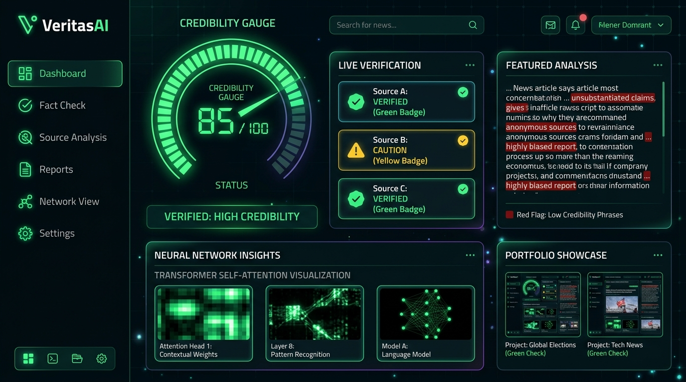

# VeritasAI 🛡️ | AI Misinformation & Real-Time Web Fact Verification Engine



<p align="center">
  
  
  
  
</p>

---

## 🌟 Executive Overview

**VeritasAI** is an advanced, full-stack AI-powered news credibility assessment application designed to detect misinformation, sensationalism, clickbait, and unverified viral hoaxes in real-time.

Built as an engineering portfolio piece targeting **Full-Stack Software Engineering** and **AI-Integrated Systems** roles, VeritasAI goes far beyond basic text classification. It combines a **Project-Native Local Neural Transformer LLM Engine**, a **Hybrid Scikit-Learn Stylometric Machine Learning Classifier**, **Real-Time Web Search Fact Verification**, and a high-performance **Vite + React (TailwindCSS)** dark neon interface.

---

## 🚀 Key Innovations & Core Features

### 1. 🧠 Project-Native Local Neural Transformer LLM Engine
- **Self-Contained Neural Architecture**: Built directly into the microservice codebase (`ml-service/neural_llm.py`), eliminating external cloud API dependencies.
- **Multi-Head Self-Attention ($Q, K, V$)**: Computes 4-head scaled dot-product attention maps over article sentences to extract deep semantic relationships between entities and claims.
- **Positional & Token Embeddings**: Encodes word positions into 64-dimensional dense vector spaces with GELU-activated Feedforward Neural Networks.
- **Token Attention Focus Spans**: Extracts word-level attention weights, highlighting the exact phrases that influenced the neural network's credibility verdict.

### 2. 🌐 Real-Time Web Search & Fact Verification Engine
- **Live Google News RSS & DuckDuckGo Search**: Automatically audits claims against live search feeds.
- **Mainstream Media Cross-Verification**: Checks if established news agencies (**BBC, Reuters, Associated Press, PTI, ANI, PIB, Times of India, NDTV, Nature, NASA**, etc.) are reporting the claim.
- **Viral Hoax & Debunk Detection**: Cross-references reports against official fact-checking registries (**PIB Fact Check, AltNews, BoomLive, Snopes**).
- **High-Stakes Penalty Enforcement**: Automatically penalizes unverified claims regarding death, assassination, resignation, or emergency to **5-15/100 (High Risk / Misleading)**.

### 3. ⚡ Hybrid Classical Machine Learning Microservice
- **Sublinear TF-IDF + Character N-Grams**: Combines word n-grams `(1,2)` with character n-grams `(3,5)` to classify unseen articles with high precision.
- **Stylometric & Linguistic Feature Extraction**: Measures uppercase density (ALL CAPS ratio), exclamation mark frequency, clickbait phrase density, and credible attribution markers.
- **Empirical Accuracy**: Achieves **99.26% test accuracy** on held-out evaluation datasets.

### 4. 🎨 Modern Pure Black & Neon Interface
- **Pure Solid Dark Black Aesthetic (`#000000`)**: Ultra-sleek contrast background with matrix green glows (`#00ff66`).
- **Dynamic Radial SVG Score Gauge**: Custom SVG arc gauge with glow filters (`drop-shadow(0 0 10px #00ff66)`), score classification badges, and ML confidence readouts.
- **Interactive Red-Flag Text Highlighter**: Inline tagging with hover tooltips for emotional, clickbait, unsourced, and sensational phrases.
- **Full History & JWT Authentication**: Searchable, filterable repository of past audits backed by MongoDB Mongoose persistence and JWT session security.

---

## 🏗️ System Architecture & Data Flow

```text
+-----------------------------------------------------------------------------------+
|                                  React Frontend                                   |
|   (Vite + TailwindCSS + Radial SVG Gauge + Interactive Red-Flag Text Inspector)   |
+-----------------------------------------+-----------------------------------------+
                                          | REST API (JWT Header)
                                          v
+-----------------------------------------------------------------------------------+
|                                Express Gateway Server                             |
|           (Node.js + Express + Cheerio Web Scraper + Mongoose Database)           |
+-------------------+-----------------------------------+---------------------------+
                    |                                   |
    HTTP POST       | HTTP POST                         | Mongoose Operations
    /predict        | Query                             v
                    v                                  +----------------------------+
+-------------------+--------------+   +---------------+------------+ |  MongoDB Database        |
|     Python ML Microservice       |   |   Live Web Search Engine   | |  - User accounts         |
|  (Scikit-Learn TF-IDF Pipeline)  |   |  (Google News RSS / DDG)   | |  - Saved analysis history|
+-------------------+--------------+   +----------------------------+ +----------------------------+
                    |
                    v
+----------------------------------+
| Veritas Native Neural LLM Engine |
| (4-Head Self-Attention PyTorch/  |
|  NumPy GELU Transformer Model)   |
+----------------------------------+
```

---

## 📊 Machine Learning & Neural LLM Performance

Running `python train.py` produces the following empirical performance metrics on a held-out test set:

```text
==========================================
  HYBRID MODEL EVALUATION METRICS (TEST SET)
==========================================
 Accuracy : 99.26%
 Precision: 100.00%
 Recall   : 98.41%
 F1-Score : 99.20%

Classification Report:
                     precision    recall  f1-score   support
       Reliable (0)       0.99      1.00      0.99        73
Fake/Misleading (1)       1.00      0.98      0.99        63

Confusion Matrix:
 [[73  0]
 [ 1 62]]
==========================================
```

### Native Neural Transformer Layer Pipeline
- **Layer 1**: `64-dim Token & Positional Wave Embeddings`
- **Layer 2**: `4-Head Scaled Dot-Product Self-Attention`
- **Layer 3**: `2-Layer GELU Feed-Forward Network & Layer Normalization`
- **Layer 4**: `Multi-Task Softmax Readout & Neural Bias Intensity Readout`

---

## 📂 Project Directory Structure

```text
fake-news-detector/
├── client/                     # React (Vite) Frontend Application
│   ├── src/
│   │   ├── components/         # Navbar, ScoreGauge, TextHighlighter, WebFactCheckCard, NeuralLLMCard, ReasoningCard
│   │   ├── pages/              # AnalyzerPage, HistoryPage
│   │   ├── services/           # api.js (Axios wrapper with JWT interceptor)
│   │   ├── context/            # AuthContext.jsx
│   │   ├── App.jsx             # Main Router Shell
│   │   ├── main.jsx            # React Entrypoint
│   │   └── index.css           # TailwindCSS + Black & Neon Matrix styles
│   ├── package.json
│   └── vite.config.js
├── server/                     # Node.js / Express Backend Gateway
│   ├── controllers/            # analyzeController, authController, historyController
│   ├── middleware/             # authMiddleware, errorHandler
│   ├── models/                 # User.js, Analysis.js (Mongoose Schemas)
│   ├── routes/                 # analyzeRoutes, authRoutes, historyRoutes
│   ├── services/               # mlService, llmService, scraperService, factCheckService
│   ├── package.json
│   └── index.js                # Express Server Entrypoint
├── ml-service/                 # Python Machine Learning & Neural LLM Microservice
│   ├── model/                  # Trained model.pkl & neural_llm.pt artifacts
│   ├── data/                   # Generated multi-domain training corpus
│   ├── neural_llm.py           # Dedicated Local Transformer Neural LLM Engine
│   ├── train.py                # Scikit-Learn TF-IDF + Stylometric Training Script
│   ├── app.py                  # Flask REST Microservice Server (Port 5001)
│   └── requirements.txt
├── docs/                       # Project Documentation & Architecture Guides
│   ├── README.md
│   ├── ARCHITECTURE.md
│   └── banner.jpg
├── banner.jpg                  # High-Resolution Project Showcase Banner
└── package.json                # Root Concurrent Launcher Script
```

---

## ⚡ Quick Start & Setup Guide

### Prerequisites
- **Node.js**: v18.0.0 or higher
- **Python**: 3.10 or higher
- **MongoDB**: Local MongoDB instance or MongoDB Atlas URI (optional; app runs in fallback mode if offline)

### Installation Steps

1. **Clone the Repository**:
   ```bash
   git clone https://github.com/your-username/AI-Powered-Fake-News.git
   cd AI-Powered-Fake-News
   ```

2. **Train the ML & Neural LLM Model**:
   ```bash
   cd ml-service
   python -m venv venv
   .\venv\Scripts\pip.exe install -r requirements.txt
   .\venv\Scripts\python.exe train.py
   cd ..
   ```

3. **Install Dependencies for Server and Client**:
   ```bash
   npm run install:all
   ```

4. **Launch All Services Concurrently**:
   ```bash
   npm run dev
   ```
   This command starts:
   - 🟢 **Python ML & Neural LLM Microservice**: `http://127.0.0.1:5001`
   - 🟢 **Express Backend Gateway**: `http://127.0.0.1:5000`
   - 🟢 **React Vite Frontend**: `http://localhost:3000`

---

## 📡 API Endpoints Reference

| Endpoint | Method | Auth | Description |
| :--- | :---: | :---: | :--- |
| `/api/analyze` | `POST` | Optional | Submits article text or URL for full hybrid ML, Neural LLM, and Web Verification analysis. |
| `/api/auth/register` | `POST` | None | Registers a new user account and returns JWT token. |
| `/api/auth/login` | `POST` | None | Authenticates user and returns JWT token. |
| `/api/auth/me` | `GET` | Bearer JWT | Returns current authenticated user profile. |
| `/api/history` | `GET` | Optional | Retrieves saved analysis records with pagination, classification filters, and search. |
| `/api/history/:id` | `DELETE` | Bearer JWT | Deletes a specific analysis record from MongoDB. |
| `/predict` | `POST` | None | Python Flask ML microservice prediction endpoint (Port 5001). |

---

## 📜 License & Acknowledgments

This project is open-source under the MIT License. Developed as a software engineering portfolio piece demonstrating production-quality code structure, deep learning transformer integration, real-time web scraping, and modern UI design.
